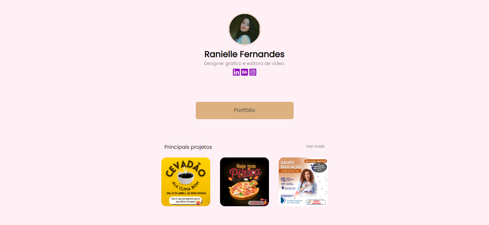

<h1 align="center"> Links Sociais </h1>

Página de agrupamento de links.
 

  <a href="#-tecnologias">Tecnologias</a>&nbsp;&nbsp;&nbsp;|&nbsp;&nbsp;&nbsp;
  <a href="#-projeto">Projeto</a>&nbsp;&nbsp;&nbsp;&nbsp;&nbsp;&nbsp;

 

  

## 🚀 Tecnologias

Esse projeto foi desenvolvido com as seguintes tecnologias:

- HTML e CSS
- Git e Github

## 💻 Projeto

Além do botão com link para entrar em contato, coloquei uma sessão com uma visualização prévia do portfólio.

## 🖱️ Visite

https://ranielle-fernandes.netlify.app/

---
👨‍💻 Desenvolvedor
 
- Jonatha Fernandes
